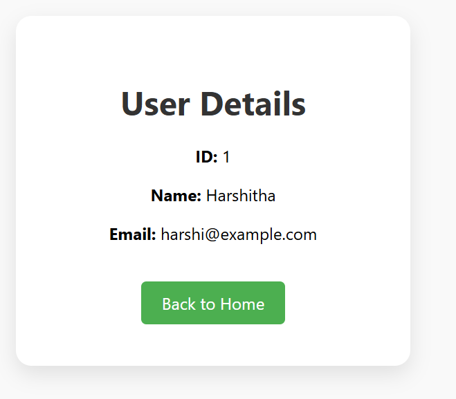

# Experiment 12: Dynamic Route in React Router (/user/:id)

## 🎯 Objective
To create a **dynamic route** using React Router that displays user details based on the route parameter.

---

## Screenshots

Here’s a preview of the app:





## 🛠️ Steps Followed

1. **Created React App**
   ```bash
   npx create-react-app react-router-dynamic
   cd react-router-dynamic
